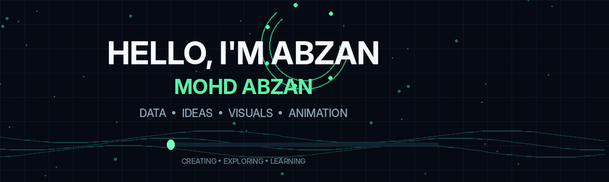
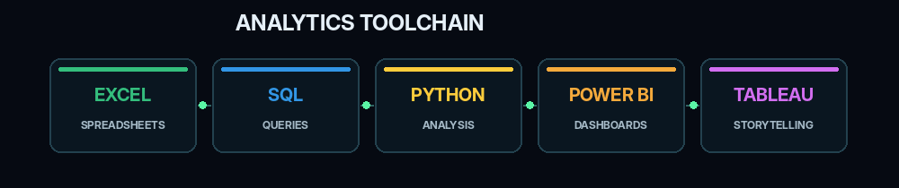
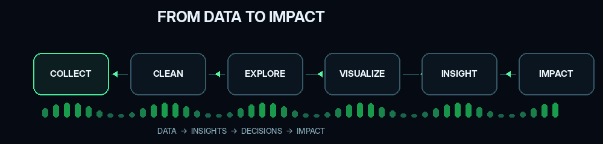
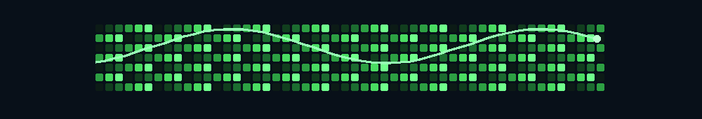

<!-- ========================= -->
<!--        HERO BANNER        -->
<!-- ========================= -->

  

 

<!-- ========================= -->
<!--      WELCOME MESSAGE      -->
<!-- ========================= -->

<h1 align="center">
  👋 HELLO, I'M ABZAN
</h1>

  <b>MOHD ABZAN</b>

  <i>
    Turning data into insights • insights into decisions • decisions into impact
  </i>

  <code>DATA</code>
  →
  <code>ANALYSIS</code>
  →
  <code>INSIGHTS</code>
  →
  <code>DECISIONS</code>
  →
  <code>IMPACT</code>

 

<!-- ========================= -->
<!--         ABOUT ME          -->
<!-- ========================= -->

<h2 align="center">🧑‍💻 ABOUT ME</h2>

  I'm <b>Mohd Abzan</b>, exploring the world of
  <b>Business Analytics, Data, Technology and Visualization.</b>

  I enjoy discovering patterns, understanding data,
  building visual stories and continuously improving my analytical skills.

 

🎓 <b>MBA Business Analytics</b>

&nbsp;&nbsp;•&nbsp;&nbsp;

📊 <b>Data Analytics</b>

&nbsp;&nbsp;•&nbsp;&nbsp;

📈 <b>Data Visualization</b>

&nbsp;&nbsp;•&nbsp;&nbsp;

💻 <b>Technology</b>

 

<!-- ========================= -->
<!--      CURRENT FOCUS        -->
<!-- ========================= -->

<h2 align="center">⚡ CURRENT FOCUS</h2>

  🔎 Exploring Data
  &nbsp;→&nbsp;
  🧹 Cleaning Data
  &nbsp;→&nbsp;
  📊 Analyzing Data
  &nbsp;→&nbsp;
  📈 Visualizing Data
  &nbsp;→&nbsp;
  💡 Finding Insights

 

<!-- ========================= -->
<!--       ANALYTICS TOOLS     -->
<!-- ========================= -->

<h2 align="center">🛠️ ANALYTICS TOOLKIT</h2>

  <i>From raw data to meaningful insights</i>

 

  

 

🟢 <b>Microsoft Excel</b>
&nbsp;&nbsp;→&nbsp;&nbsp;

🔵 <b>SQL</b>
&nbsp;&nbsp;→&nbsp;&nbsp;

🐍 <b>Python</b>
&nbsp;&nbsp;→&nbsp;&nbsp;

🟡 <b>Power BI</b>
&nbsp;&nbsp;→&nbsp;&nbsp;

🟣 <b>Tableau</b>

 

<!-- ========================= -->
<!--       DATA WORKFLOW       -->
<!-- ========================= -->

<h2 align="center">⚡ MY DATA WORKFLOW</h2>

  

  📥 <b>COLLECT</b>
  →
  🧹 <b>CLEAN</b>
  →
  🔎 <b>EXPLORE</b>
  →
  📊 <b>VISUALIZE</b>
  →
  💡 <b>INSIGHT</b>
  →
  🎯 <b>IMPACT</b>

 

<!-- ========================= -->
<!--      AREAS OF INTEREST    -->
<!-- ========================= -->

<h2 align="center">🎯 AREAS OF INTEREST</h2>

📊 Data Analysis  
 
📈 Data Visualization  
 
🗄️ Data Management  
 
💡 Business Intelligence  
 
📌 KPI Analysis  
 
👥 Customer Analytics  
 
🔎 Data-Driven Problem Solving  
 
🎯 Business Decision Making

 

<!-- ========================= -->
<!--      ANALYTICS APPROACH   -->
<!-- ========================= -->

<h2 align="center">🔍 MY ANALYTICS APPROACH</h2>

📊 <b>DATA</b>
 
⬇
 
🔎 <b>ANALYSIS</b>
 
⬇
 
💡 <b>INSIGHTS</b>
 
⬇
 
🎯 <b>DECISIONS</b>
 
⬇
 
🚀 <b>IMPACT</b>

 

  <i>
    "Good analysis doesn't just explain what happened.
    It helps understand what to do next."
  </i>

 

<!-- ========================= -->
<!--    STREAKS THROUGH DAY    -->
<!-- ========================= -->

<h2 align="center">🔥 STREAKS THROUGH THE DAY</h2>

  <i>
    Showing up • Learning • Building • Improving
  </i>

 

🌅 <b>START</b>
&nbsp; → &nbsp;
📚 <b>LEARN</b>
&nbsp; → &nbsp;
💻 <b>BUILD</b>
&nbsp; → &nbsp;
📊 <b>ANALYZE</b>
&nbsp; → &nbsp;
🌙 <b>REFLECT</b>

 

🔥 Keep the streak alive  
 
⚡ One step every day  
 
📈 Small progress becomes big progress

 

<!-- ========================= -->
<!--       GITHUB STATS        -->
<!-- ========================= -->

<h2 align="center">📊 GITHUB ANALYTICS</h2>

  <i>My GitHub activity and development journey</i>

 

 

<!-- ========================= -->
<!--     CONTRIBUTION SNAKE    -->
<!-- ========================= -->

<h2 align="center">🐍 CONTRIBUTION SNAKE</h2>

  <i>Every contribution tells a story.</i>

 

  

 

<!-- ========================= -->
<!--       CONTRIBUTIONS       -->
<!-- ========================= -->

<h2 align="center">📈 CONTRIBUTION JOURNEY</h2>

🟢 Learn  
→  
🟢 Practice  
→  
🟢 Build  
→  
🟢 Improve  
→  
🟢 Repeat

 

  <i>
    Consistency beats intensity.
  </i>

 

<!-- ========================= -->
<!--      LEARNING MINDSET     -->
<!-- ========================= -->

<h2 align="center">🧠 LEARNING MINDSET</h2>

🔎 Stay Curious  
 
📚 Keep Learning  
 
🧪 Keep Experimenting  
 
💻 Keep Building  
 
📈 Keep Improving

 

<!-- ========================= -->
<!--        TECH JOURNEY       -->
<!-- ========================= -->

<h2 align="center">🚀 MY TECH JOURNEY</h2>

Excel
&nbsp; → &nbsp;
SQL
&nbsp; → &nbsp;
Python
&nbsp; → &nbsp;
Power BI
&nbsp; → &nbsp;
Tableau
&nbsp; → &nbsp;
More to Explore...

 

  <i>
    Always learning something new.
  </i>

 

<!-- ========================= -->
<!--        CONNECTION         -->
<!-- ========================= -->

<h2 align="center">🌐 LET'S CONNECT</h2>

 

<!-- ========================= -->
<!--          QUOTE            -->
<!-- ========================= -->

🚀 <b>Learn.</b>
&nbsp;&nbsp;
📊 <b>Analyze.</b>
&nbsp;&nbsp;
💡 <b>Understand.</b>
&nbsp;&nbsp;
🎯 <b>Decide.</b>
&nbsp;&nbsp;
🔥 <b>Repeat.</b>

 

<h2 align="center">
  ✨ THANKS FOR VISITING ✨
</h2>

  <i>
    Stay curious. Keep learning. Never stop building.
  </i>

 

  <b>💙 DATA → INSIGHTS → DECISIONS → IMPACT 🚀</b>

 

  

