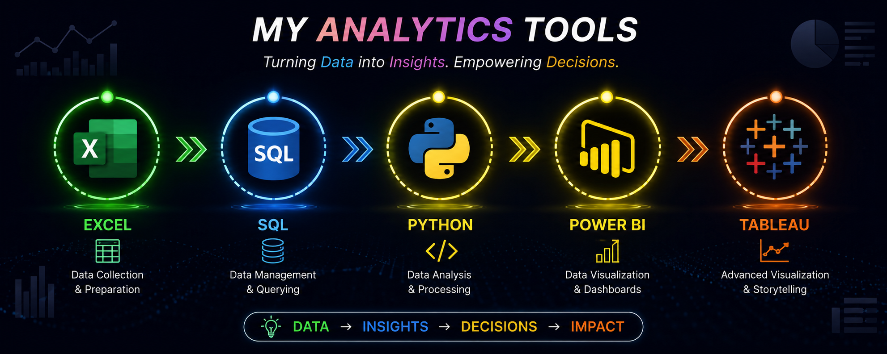

<!-- ========================================================= -->
<!--                     MOHD ABZAN                            -->
<!--              GITHUB PROFILE README                        -->
<!-- ========================================================= -->

<!-- ========================== BANNER ======================== -->

  

<!-- ======================= INTRO ============================ -->

  

  <strong>MBA BUSINESS ANALYTICS STUDENT</strong>

  <i>Transforming Data into Insights • Empowering Decisions • Creating Impact</i>

  📊 Data Analysis
  &nbsp; • &nbsp;
  📈 Data Visualization
  &nbsp; • &nbsp;
  🗄️ SQL & Data Management
  &nbsp; • &nbsp;
  💡 Business Intelligence

---

<!-- ======================== ABOUT ME ======================== -->

<h2 align="center">👨‍💼 ABOUT ME</h2>

  I'm <strong>Mohd Abzan</strong>, an
  <strong>MBA Business Analytics Student</strong>
  interested in the intersection of
  <strong>Business, Data & Technology</strong>.

  I enjoy exploring data, identifying patterns, creating meaningful
  visualizations and turning analytical findings into insights that
  can support better business decisions.

  🎓 <strong>MBA Business Analytics Student</strong>
  &nbsp; • &nbsp;
  📊 <strong>Data Analysis</strong>
  &nbsp; • &nbsp;
  📈 <strong>Data Visualization</strong>
  &nbsp; • &nbsp;
  🗄️ <strong>SQL</strong>
  &nbsp; • &nbsp;
  🐍 <strong>Python</strong>
  &nbsp; • &nbsp;
  💡 <strong>Business Intelligence</strong>

---

<!-- ===================== ANALYTICS TOOLS ==================== -->

<h2 align="center">🛠️ MY ANALYTICS TOOLS</h2>

  <i>From raw data to meaningful business insights</i>

  

  
  
  
  
  
  

---

<!-- ====================== DATA WORKFLOW ==================== -->

<h2 align="center">⚡ MY DATA WORKFLOW</h2>

📥 <strong>COLLECT</strong>
&nbsp; → &nbsp;

🧹 <strong>CLEAN</strong>
&nbsp; → &nbsp;

🔎 <strong>ANALYZE</strong>
&nbsp; → &nbsp;

📊 <strong>VISUALIZE</strong>
&nbsp; → &nbsp;

💡 <strong>INSIGHT</strong>
&nbsp; → &nbsp;

🎯 <strong>DECIDE</strong>

  <strong>DATA → INSIGHTS → DECISIONS → IMPACT</strong>

---

<!-- ==================== AREAS OF INTEREST =================== -->

<h2 align="center">🎯 AREAS OF INTEREST</h2>

  📊 Data Analysis
  &nbsp; • &nbsp;
  📈 Data Visualization
  &nbsp; • &nbsp;
  🗄️ Data Management
  &nbsp; • &nbsp;
  💡 Business Intelligence

  📌 KPI Analysis
  &nbsp; • &nbsp;
  🎯 Business Decision Making
  &nbsp; • &nbsp;
  👥 Customer Analytics
  &nbsp; • &nbsp;
  📈 Business Performance

  🔍 Data-Driven Problem Solving

---

<!-- =================== ANALYTICS APPROACH ================== -->

<h2 align="center">🔎 MY ANALYTICS APPROACH</h2>

📊 <strong>DATA</strong>
&nbsp; → &nbsp;

🔎 <strong>ANALYSIS</strong>
&nbsp; → &nbsp;

💡 <strong>INSIGHTS</strong>
&nbsp; → &nbsp;

🎯 <strong>DECISIONS</strong>
&nbsp; → &nbsp;

🚀 <strong>IMPACT</strong>

  <i>Turning business questions into data-driven insights.</i>

---

<!-- ================= PROJECTS & LEARNING =================== -->

<h2 align="center">🚀 PROJECTS & LEARNING</h2>

  <i>
    Exploring practical applications of business analytics,
    data visualization and decision-making.
  </i>

| Area | Focus |
|---|---|
| 📊 Business Performance Analysis | Analyzing KPIs, trends and business performance |
| 📈 Data Visualization | Creating dashboards and visual stories from data |
| 👥 Customer Analytics | Exploring customer behavior and business patterns |
| 🗄️ SQL Data Analysis | Querying, filtering and analyzing structured data |
| 🐍 Python Analytics | Exploring data using Python and analytical libraries |

---

<!-- ==================== GITHUB ANALYTICS =================== -->

<h2 align="center">📊 GITHUB ANALYTICS</h2>

  <i>My GitHub activity, repositories and development journey</i>

<!-- GITHUB STATS -->

<h3 align="center">📈 GitHub Statistics</h3>

  

<!-- MOST USED LANGUAGES -->

<h3 align="center">💻 Most Used Languages</h3>

  

<!-- CONTRIBUTION STREAK -->

<h3 align="center">🔥 Contribution Streak</h3>

  

<!-- CONTRIBUTION GRAPH -->

<h3 align="center">📈 Contribution Graph</h3>

  

<!-- CONTRIBUTION SNAKE -->

<h3 align="center">🐍 Contribution Activity</h3>

  

---

<!-- ====================== CURRENT FOCUS ===================== -->

<h2 align="center">🎯 CURRENT FOCUS</h2>

  📚 MBA Business Analytics
  &nbsp; • &nbsp;
  📊 Business & Data Analysis
  &nbsp; • &nbsp;
  📈 Data Visualization

  🗄️ SQL & Data Management
  &nbsp; • &nbsp;
  🐍 Python for Analytics
  &nbsp; • &nbsp;
  💡 Business Intelligence

  🧠 Data-Driven Decision Making

---

<!-- ===================== ALWAYS LEARNING =================== -->

<h2 align="center">📚 ALWAYS LEARNING</h2>

🔹 Business Analytics
&nbsp; • &nbsp;
🔹 Data Visualization
&nbsp; • &nbsp;
🔹 SQL
&nbsp; • &nbsp;
🔹 Python

🔹 Power BI
&nbsp; • &nbsp;
🔹 Tableau
&nbsp; • &nbsp;
🔹 Business Intelligence
&nbsp; • &nbsp;
🔹 Data-Driven Strategy

---

<!-- ====================== DATA MINDSET ===================== -->

<h2 align="center">💭 DATA MINDSET</h2>

  <i>
    "Without data, you're just another person with an opinion."
  </i>

  <strong>— W. Edwards Deming</strong>

---

<!-- ===================== CONNECT WITH ME =================== -->

<h2 align="center">🤝 CONNECT WITH ME</h2>

---

<!-- ======================== FOOTER ========================= -->

  <strong>📊 DATA → INSIGHTS → DECISIONS → IMPACT</strong>

  <i>Thanks for visiting my GitHub profile! 🚀</i>

  

