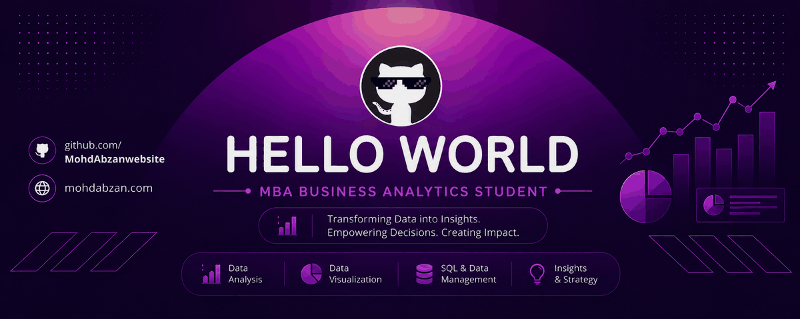
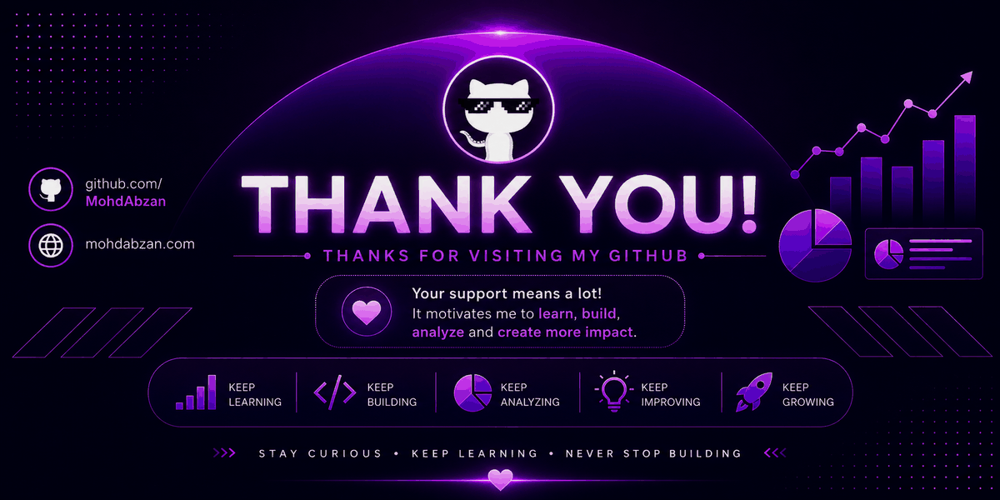

<!-- ===================================================== -->
<!--                    HELLO / INTRO                      -->
<!-- ===================================================== -->

  

  

  📊 Business Analytics &nbsp; • &nbsp;
  💻 Technology &nbsp; • &nbsp;
  📈 Data Visualization &nbsp; • &nbsp;
  🚀 Continuous Learning

  <i>
    Turning data into insights, insights into decisions,
    and decisions into impact.
  </i>

  🔎 Data &nbsp;→&nbsp;
  🧠 Analysis &nbsp;→&nbsp;
  💡 Insights &nbsp;→&nbsp;
  🎯 Decisions &nbsp;→&nbsp;
  🚀 Impact

---

<!-- ===================================================== -->
<!--                      ABOUT ME                         -->
<!-- ===================================================== -->

<h2 align="center">🧑‍💻 About Me</h2>

  I'm <b>Mohd Abzan</b>, an MBA Business Analytics student
  passionate about data, technology, visualization and
  data-driven decision making.

  I enjoy exploring data, discovering patterns, building dashboards,
  solving problems and turning information into meaningful insights.

  🎓 MBA Business Analytics
  &nbsp; • &nbsp;
  📊 Data Analytics
  &nbsp; • &nbsp;
  📈 Data Visualization
  &nbsp; • &nbsp;
  💻 Technology

---

<!-- ===================================================== -->
<!--                   CURRENT FOCUS                       -->
<!-- ===================================================== -->

<h2 align="center">⚡ Currently Focused On</h2>

  🧹 Data Cleaning
  &nbsp; • &nbsp;
  🔎 Data Exploration
  &nbsp; • &nbsp;
  📊 Data Analysis

  📈 Dashboard Development
  &nbsp; • &nbsp;
  💡 Business Insights
  &nbsp; • &nbsp;
  🎯 Decision Making

---

<!-- ===================================================== -->
<!--                  ANALYTICS TOOLKIT                    -->
<!-- ===================================================== -->

<h2 align="center">🛠️ Analytics Toolkit</h2>

  <i>From raw data to meaningful insights.</i>

  

  🟢 <b>Microsoft Excel</b>
  &nbsp; • &nbsp;
  🔵 <b>SQL</b>
  &nbsp; • &nbsp;
  🐍 <b>Python</b>
  &nbsp; • &nbsp;
  🟡 <b>Power BI</b>
  &nbsp; • &nbsp;
  🟣 <b>Tableau</b>

---

<!-- ===================================================== -->
<!--                   DATA WORKFLOW                       -->
<!-- ===================================================== -->

<h2 align="center">🔄 My Data Workflow</h2>

  

  📥 Collect
  &nbsp;→&nbsp;
  🧹 Clean
  &nbsp;→&nbsp;
  🔎 Explore
  &nbsp;→&nbsp;
  📊 Analyze
  &nbsp;→&nbsp;
  📈 Visualize
  &nbsp;→&nbsp;
  💡 Insight
  &nbsp;→&nbsp;
  🎯 Impact

---

<!-- ===================================================== -->
<!--                 AREAS OF INTEREST                     -->
<!-- ===================================================== -->

<h2 align="center">🎯 Areas of Interest</h2>

  📊 Data Analytics
  &nbsp; • &nbsp;
  📈 Data Visualization
  &nbsp; • &nbsp;
  💡 Business Intelligence

  📌 KPI Analysis
  &nbsp; • &nbsp;
  👥 Customer Analytics
  &nbsp; • &nbsp;
  🗄️ Data Management

  🔎 Data-Driven Problem Solving
  &nbsp; • &nbsp;
  🎯 Business Decision Making

---

<!-- ===================================================== -->
<!--                  ANALYTICS MINDSET                    -->
<!-- ===================================================== -->

<h2 align="center">🧠 My Analytics Mindset</h2>

  📊 <b>Understand</b>
  &nbsp;→&nbsp;
  🔎 <b>Explore</b>
  &nbsp;→&nbsp;
  💡 <b>Discover</b>
  &nbsp;→&nbsp;
  🎯 <b>Decide</b>
  &nbsp;→&nbsp;
  🚀 <b>Improve</b>

  <i>
    Good analysis doesn't just explain what happened —
    it helps determine what to do next.
  </i>

---

<!-- ===================================================== -->
<!--                    DAILY STREAK                       -->
<!-- ===================================================== -->

<h2 align="center">🔥 Daily Streak</h2>

  <i>
    Showing up • Learning • Building • Improving
  </i>

  

  🌱 Learn
  &nbsp;→&nbsp;
  💻 Build
  &nbsp;→&nbsp;
  🧪 Experiment
  &nbsp;→&nbsp;
  📈 Improve
  &nbsp;→&nbsp;
  🔥 Repeat

---

<!-- ===================================================== -->
<!--                  CONTRIBUTION SNAKE                    -->
<!-- ===================================================== -->

<h2 align="center">🐍 Contribution Journey</h2>

  

  <i>
    Every contribution is a small step toward something bigger.
  </i>

---

<!-- ===================================================== -->
<!--                   TECH JOURNEY                        -->
<!-- ===================================================== -->

<h2 align="center">🚀 My Tech Journey</h2>

  Excel
  &nbsp;→&nbsp;
  SQL
  &nbsp;→&nbsp;
  Python
  &nbsp;→&nbsp;
  Power BI
  &nbsp;→&nbsp;
  Tableau
  &nbsp;→&nbsp;
  🚀 What's Next?

  <i>
    Always learning something new.
  </i>

---

<!-- ===================================================== -->
<!--                    DAILY MINDSET                      -->
<!-- ===================================================== -->

<h2 align="center">🌱 Every Day</h2>

  ☀️ Start with curiosity
  &nbsp;→&nbsp;
  📚 Learn
  &nbsp;→&nbsp;
  💻 Build
  &nbsp;→&nbsp;
  🔎 Explore
  &nbsp;→&nbsp;
  📊 Analyze
  &nbsp;→&nbsp;
  🌙 Reflect

  <b>
    🔥 One day • One improvement • One step forward
  </b>

---

<!-- ===================================================== -->
<!--                    PORTFOLIO                          -->
<!-- ===================================================== -->

<h2 align="center">🌐 My Portfolio</h2>

  

  <i>
    Explore my projects, skills, work and professional journey.
  </i>

---

<!-- ===================================================== -->
<!--                     GITHUB                            -->
<!-- ===================================================== -->

<h2 align="center">💻 GitHub</h2>

  

---

<!-- ===================================================== -->
<!--                    FINAL MESSAGE                      -->
<!-- ===================================================== -->

  

<h3 align="center">
  ✨ Thanks for Visiting My GitHub ✨
</h3>

  👀 Explore
  &nbsp; • &nbsp;
  💡 Learn
  &nbsp; • &nbsp;
  🛠️ Build
  &nbsp; • &nbsp;
  📊 Analyze
  &nbsp; • &nbsp;
  🚀 Grow

  <i>
    Stay curious. Keep learning. Never stop building.
  </i>

  <b>
    💙 DATA → INSIGHTS → DECISIONS → IMPACT 🚀
  </b>

